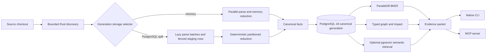

<div align="center">

# Cartograph

**Generation-safe code intelligence for AI coding agents.**

Native Rust CLI and MCP server · PostgreSQL 18 · code-aware BM25 · typed code graph

[](https://github.com/adder-factory/cartograph/releases/latest)
[](https://github.com/adder-factory/cartograph/actions/workflows/v2-rust.yml)
[](LICENSE)
[](https://www.rust-lang.org/)

[Quick start](#quick-start) · [Agent workflow](#agent-workflow) ·
[Large codebases](#large-codebases-and-streaming-indexing) ·
[Architecture](#architecture) · [Documentation](#documentation)

</div>

---

Cartograph turns a source checkout into a searchable, immutable-generation code
graph. It gives coding agents compact evidence about declarations, references,
call flow, change impact, affected tests, and source freshness through one native
CLI and the [Model Context Protocol](https://modelcontextprotocol.io/).

The source checkout remains the source of truth. Every evidence packet carries
generation provenance, freshness, confidence, truncation, and explicit
abstention instead of presenting stale or incomplete data as certainty.

> [!IMPORTANT]
> Cartograph v2 is PostgreSQL-only. It requires PostgreSQL 18.4 or newer within
> major version 18, ParadeDB `pg_search` 0.25.2, and pgvector 0.8.4 or newer
> (0.8.6 recommended for external PostgreSQL).
> There is no SQLite runtime, compatibility mode, importer, optional feature,
> or fallback.

## What Cartograph gives an agent

| Question | Evidence |
| --- | --- |
| Where is this declared or referenced? | Exact symbol, path, reference, and identifier lookup |
| Which code is most relevant? | Code-aware BM25 over names, implementation identifiers, and documentation |
| What calls this, and what does it call? | Typed callers, callees, imports, references, and shortest paths |
| What could this change affect? | Bounded reverse impact and structurally connected tests |
| Where is numerical behavior risky or statically unknown? | Generation-scoped Rust operation/hazard/precision sites with exact spans and explicit evidence limits |
| Is the graph current? | Immutable generation identity and exact supported-source freshness |
| What changed in the working tree? | Separately labeled live overlay and Git-ref review packets |
| Is an LLM required? | No for exact, lexical, graph, review, freshness, or affected-test workflows |

Cartograph also supports standard SCIP export, persistent per-file SCIP overlays,
model-scoped semantic retrieval, generated artifacts with explicit provenance,
and deterministic task-intent routing.

## Quick start

### 1. Install the native executable

macOS and Linux:

```sh
curl -fsSL https://raw.githubusercontent.com/adder-factory/cartograph/main/install.sh | sh
cartograph --version
```

Windows PowerShell:

```powershell
irm https://raw.githubusercontent.com/adder-factory/cartograph/main/install.ps1 | iex
cartograph --version
```

The installers select the native archive for the host, verify it against the
release `SHA256SUMS`, and place `cartograph` on the user PATH.

### 2. Build the first graph

On macOS or Linux with a local Docker daemon:

```sh
cd /path/to/project
cartograph db start --project-path .
cartograph doctor .
cartograph index .
cartograph status .
cartograph context 'explain the primary request flow' --project-path .
```

`db start` creates project-owned, loopback-only resources and pulls the pinned
upstream ParadeDB image. `doctor` fails closed unless PostgreSQL, pg_search,
pgvector, preload, BM25, migrations, and code tokenization all pass.
`doctor --json` retains `ready` as the backward-compatible hard-capability
result and mirrors it as `capabilitiesReady`. Its separate `projectReadiness`
object reports database, index, freshness, deterministic retrieval, optional
semantic retrieval, on-disk registration, live MCP transport, and overall
onboarding states. Checks that `doctor` does not perform are `not_checked`,
never inferred from another successful layer; `nextActions` contains only
path-safe follow-up commands.

### 3. Connect a coding agent

Cartograph writes only project-local MCP configuration and pins the absolute
native executable path:

```sh
# OpenAI Codex
cartograph install --yes --target codex --location local --project-path .

# Claude Code
cartograph install --yes --target claude --location local --project-path .

# Cursor
cartograph install --yes --target cursor --location local --project-path .
```

If the default managed database port is occupied, pass the selected port to
both `db start --port <PORT>` and `install --managed-database-port <PORT>`.
The installer writes that non-secret loopback port into the portable `serve`
arguments for the selected host. Direct project commands discover an existing
project-owned container's published port when neither the flag nor
`CARTOGRAPH_MANAGED_DATABASE_PORT` is set; an explicit wrong port fails with
the discovered port instead of a generic connection error.

Versioned native installs register the stable
`~/.cartograph-cli/current/bin/cartograph` launcher. A normal version-to-version
upgrade is one resumable command from the project root:

```sh
cartograph upgrade --apply --project-path .
```

It checksum-verifies and smoke-tests the release, switches the stable launcher,
applies safe append-only schema migrations, refreshes the current generation,
runs `doctor`, verifies a fresh next-process status, and repairs stale owned
Codex, Claude, and Cursor pins. The only routine manual boundary is closing and
reopening an already-running agent host, which cannot hot-load a replaced MCP
child. If an older managed container itself must be replaced, the command stops
with the exact backup and confirmation commands; rerun the same upgrade command
afterward to resume rather than restarting the workflow. A cold first-time
image pull has its own 15-minute budget; a timeout is reported as retryable and
never treated as evidence that the container is incompatible. A fully
idempotent rerun does not request another host reopen unless that invocation
changed the binary or repaired a host pin.
The confirmed database replacement also resumes an interruption after the old
container was stopped and renamed but before the new candidate was created; do
not rename its rollback slot manually.

### 4. Verify the live integration

A setup is ready only after all four signals pass:

1. `cartograph doctor` proves database capabilities.
2. `cartograph index` publishes one complete generation.
3. `cartograph status` reports that generation as fresh.
4. A real `find` or `context` query returns generation-scoped evidence.

A CLI request proves the executable and database path. After restarting an
agent host, make one live MCP request as the separate transport-health check.
Until that happens, `doctor` deliberately reports `liveTransport` as
`not_checked`; an on-disk registration never proves which child process an
already-running host loaded.

> [!TIP]
> Prefer agent-assisted setup? Give your coding agent the task in
> [Agent-assisted installation](docs/AGENT-INSTALL.md).

## Platform and database support

| Host | Native release | Managed local database | External PostgreSQL |
| --- | ---: | ---: | ---: |
| macOS 26 on Apple Silicon | Yes | Yes, with local Docker | Yes |
| Current 64-bit Linux, glibc 2.41+ (arm64 / x64) | Yes | Yes, with local Docker | Yes |
| Windows 11 25H2+ / Server 2025 x64 | Yes | Not enabled | Yes |

Only current 64-bit operating-system generations are release targets. Intel
macOS and every 32-bit architecture are unsupported. Linux release binaries
target Debian 13's glibc 2.41 baseline or newer. Every Linux archive is built
in a pinned Rust/Trixie container and executed in a separate pinned Debian 13
runtime container before publication.

For an external deployment, the database administrator installs PostgreSQL 18.4
or newer within major version 18, `pg_search` 0.25.2, and pgvector 0.8.4 or
newer, and creates pgvector before `pg_search`. Load the connection URL from the
shell or a secret manager rather than a committed file:

```sh
export CARTOGRAPH_DATABASE_SCHEMA='cartograph_project'
# CARTOGRAPH_DATABASE_URL must already be present in the environment.

cartograph doctor /absolute/path/to/project
cartograph index /absolute/path/to/project
cartograph status /absolute/path/to/project
```

Database URLs are secrets. Public errors, debug output, MCP responses, archives,
and project records are required to omit credentials and absolute checkout
paths. See [PostgreSQL storage and operations](docs/STORAGE-BACKENDS.md).

## Agent workflow

A reliable coding loop starts with freshness, narrows with structural evidence,
and closes with impact-aware verification:

```sh
cartograph status .
cartograph context 'fix authentication token validation' --project-path .
cartograph find 'validateToken' --by name --project-path .
cartograph graph <symbol-id> --direction impact --project-path .
cartograph affected --symbol-id <symbol-id> --project-path .
cartograph review --ref main --project-path .
```

If status is stale, run `cartograph index .` or use the bounded MCP admin action.
Indexing unchanged source is a no-op; changed source publishes a complete new
generation atomically.

### Core MCP tools

| Tool | Purpose |
| --- | --- |
| `cartograph_status` | Current generation, counts, capability readiness, and freshness |
| `cartograph_find` | Exact name/path/reference lookup or code-aware BM25 |
| `cartograph_context` | Intent-aware evidence, graph context, and edit candidates |
| `cartograph_entry_points` | Routes, commands, MCP tools, exports, and API boundaries |
| `cartograph_graph` | Callers, callees, reverse impact, paths, and symbol similarity |
| `cartograph_affected` | Bounded affected-test selection |
| `cartograph_numerical` | Generation-scoped static numerical hazards, coverage, explanations, and non-executing probe plans |
| `cartograph_review` | Git-ref plus staged, unstaged, and untracked evidence |
| `cartograph_admin` | Explicit index, sync, embedding, and maintenance jobs |

MCP profiles are `coding`, `core`, `full`, `read-only`, and `review`. Profiles
are immutable authorization ceilings with deterministic tool lists; a narrower
profile cannot call hidden tools. Cartograph supports modern stateless MCP
`2026-07-28` plus the legacy `2024-11-05` initialize path. Modern hosts should
cache the stable complete catalog and dynamically place only task-relevant
schemas in the model context; the server does not mutate tools per connection.
See [MCP usage](docs/MCP-USAGE.md#modern-protocol-and-dynamic-tool-selection).

### CLI surface

These are selected high-use forms, not the complete command inventory. Run
`cartograph --help` for the installed binary or see the
[CLI reference](docs/CLI-REFERENCE.md) for every top-level command.

```text
cartograph index [PROJECT]
cartograph status [PROJECT]
cartograph find <QUERY> --by auto|name|content|env|sql|build|path|reference|bm25|hybrid
cartograph context <TASK> [--exact-name NAME] [--exact-path PATH] [--exact-reference TEXT]
cartograph entry-points [--bucket public-exports] [--limit 20]
cartograph graph <SYMBOL_ID> --direction callers|callees|both|impact
cartograph graph <SYMBOL_ID> --direction path --to <TARGET_SYMBOL_ID>
cartograph graph <SYMBOL_ID> --direction similar --k 5 --min-score 0.3
cartograph affected [CHANGED_FILE ...] --max-nodes 40
cartograph affected --symbol-id <SYMBOL_ID> --max-nodes 40
cartograph review --ref <GIT_REF>
cartograph serve --mcp [--profile coding|core|full|read-only|review]
cartograph doctor [PROJECT]
cartograph db <COMMAND>
cartograph install --yes --target <HOST>
cartograph uninstall --yes --target <HOST>
```

Text output is optimized for concise human diagnostics. JSON is the stable
automation surface where exposed by command help.

## Large codebases and streaming indexing

No special command is required for a large first index. With the default
`generationStorage: "auto"`, Cartograph selects its PostgreSQL spill path at
64 Cargo manifests, 10,000 supported files, 64 MiB of indexed source, or when a
conservative 16x source-expansion estimate reaches `maxGenerationBytes`. A
dense smaller corpus can opt in explicitly through `.cartograph/config.json`:

```json
{
  "version": 2,
  "generationStorage": "postgres"
}
```

The spill path lazily admits at most 64 files and 64 MiB of combined source per
parse work item, reuses one parser per encountered language, and writes
file-local extraction plus resolved typed facts in bounded batches. PostgreSQL
then performs deterministic partitioned reduction behind the staging
generation's lease and fence. Readers continue to see the prior complete
generation until the new canonical generation passes validation and publishes.

This bounds the bulky per-file working set; it does not make every native
structure unlimited. Compact project-wide resolution, clone, and centrality
indexes remain bounded by `maxGenerationBytes`, while `maxSpillBytes` and
`maxSpillRows` bound the durable unordered payload. Cartograph fails closed at
either boundary rather than lowering extraction or graph quality.

Parse time and complete-index time are separate measurements. The published
[VS Code streaming benchmark](docs/v2/benchmarks/LARGE-PUBLIC-CORPUS-STREAMING.md)
records the final pre-release candidate retained with v2.1.11; it is not an
exact tagged-binary rerun. That candidate extracted 14,693 files / 171,015,058
source bytes in 23.04 seconds. The full cold request, including resolution,
reduction, exact digest, BM25 construction, and atomic publication, completed
in 467.42 seconds at 2.90 GiB maximum RSS. An unchanged-source reconciliation
took 3.19 seconds. A qualified error such as `resolve_progress_stalled` means
the watchdog observed no durable work checkpoint; it does not merely mean that
a large stage ran for a long time.

See [configuration](docs/CONFIGURATION.md),
[performance tuning](docs/PERF-TUNING.md), and
[capacity troubleshooting](docs/TROUBLESHOOTING.md#native-generation-reaches-its-capacity-bound)
for the complete limits and operator guidance.

## Architecture



The architecture has a few hard boundaries:

- **Native runtime:** Rust owns discovery, parsing, resolution, bounded parallel
  indexing, retrieval, CLI, and MCP. No Bun, Node.js, or TypeScript runtime is
  shipped.
- **One durable store:** PostgreSQL 18 owns canonical project and generation
  state. ParadeDB BM25 and model-scoped HNSW are rebuildable derived indexes.
- **Atomic publication:** incomplete or unhealthy generations never become
  current. Readers query one verified immutable generation. Large builds can
  use generation-fenced PostgreSQL spill and deterministic partitioned
  reduction without exposing staging rows.
- **Deterministic concurrency:** 1, 2, 4, 8, and 16-worker builds reduce to the
  same logical digest and ordered evidence.
- **Optional generation:** exact lookup, BM25, graph, review, freshness, and
  affected tests work without an LLM. Generative output cannot replace
  structural truth.

For crate ownership, schemas, leases, retrieval, MCP boundaries, and failure
semantics, read the [v2 architecture](docs/v2/ARCHITECTURE.md).

## Language support

The stable registry production-admits 130 language modes and the complete 163
v1 extension manifest, plus additive Python `.pyi` support. Sixty-four modes use
pinned native tree-sitter grammars; 66 mixed-markup, configuration,
domain-specific, and game-scripting modes use bounded Rust structural scanners.

Every admitted mode must prove deterministic facts, cancellation, literal
safety, parallel-worker identity, and live PostgreSQL/ParadeDB publication.
Unknown extensions are excluded rather than represented as a misleading empty
graph.

- [Language support matrix](docs/SUPPORT-MATRIX.md)
- [Game scripting language coverage](docs/v2/GAME-SCRIPTING-LANGUAGES.md)
- [Native extraction architecture](docs/v2/EXTRACTION.md)
- [Add or extend a language](docs/EXTENDING-EXTRACTORS-RESOLVERS.md)

## Managed database operations

Common read-only or idempotent lifecycle commands:

```sh
cartograph db status --project-path .
cartograph db logs --project-path . --tail 200
cartograph db usage --project-path . --format json
cartograph db compact --project-path . --format json  # dry-run plan
cartograph db derived-index --project-path .
cartograph db backup ./cartograph.backup --project-path .
cartograph db stop --project-path .
```

Restore, upgrade, derived-index rebuild, removal, import, and prune can replace
or delete state. They require the exact confirmation phrase shown by command
help and are never implied by a diagnostic request.

New or confirmed-replacement managed containers have explicit 2 GiB memory,
four-CPU, and 256-process ceilings plus bounded PostgreSQL memory and worker
settings. A 15-minute checkpoint interval, 4 GiB soft maximum WAL size, and
512 MiB recycled-WAL floor absorb rapid generation COPY/BM25 bursts without
weakening synchronous durability. `db status` reports the observed Docker
limits and compatibility; an older owned container is never silently replaced
and uses the normal backup-gated, confirmed `db upgrade` path.

Default `status` output includes compact database/schema/heap/index/TOAST
allocation in readable IEC units such as MiB and GiB. JSON and MCP retain the
exact `*Bytes` integers and add a `databaseStorage.humanReadable` projection for
display. `db usage` remains the detailed bounded report and separates schema
heap/index/TOAST, generation, and parse-cache
allocations. Parse-cache evidence distinguishes uncompressed logical payload,
live compressed storage, whole-schema allocation, and physical overhead so a
high-water TOAST file cannot masquerade as live cache data. `db compact` plans
bounded one-at-a-time concurrent B-tree rebuilds and remains read-only until
`--apply --confirm compact-online-indexes`; apply also requires verified
filesystem headroom. Legacy inline LLM keys can be audited with
`cartograph llm migrate-credentials .` and atomically moved only after an exact
environment-value match. Local backend logs rotate at 32 MiB. The bounded
`cartograph backend cleanup .` dry run reports old rotated logs and invalid PID
state.

Community ParadeDB BM25 is treated as rebuildable local derived data. Shared,
hosted, replicated, customer-facing, or paying production use requires a
separate durability and ParadeDB licensing decision.

## Migrating from v1.1.33

V2 imports only from a v1.1.33 PostgreSQL schema. It never opens or inspects a
SQLite graph.

If the only v1 index is SQLite, either rebuild v2 from the source checkout or
use the v1.1.33 binary to migrate SQLite to PostgreSQL first. The PostgreSQL v1
source and v2 destination must be distinct schemas in the same database.

Always back up the database, quiesce project writers, and run the non-mutating
preflight before the confirmed import:

```sh
cartograph db import-v1 \
  --project-path /absolute/path/to/current-project \
  --source-checkout /absolute/path/to/exact-v1-checkout \
  --source-schema cartograph_v1 \
  --dry-run \
  --format json
```

The full resumable workflow, validation rules, and retention constraints are in
[PostgreSQL storage and operations](docs/STORAGE-BACKENDS.md#import-from-v1133-postgresql).

## Security and release guarantees

- Inputs, rows, bytes, tasks, output, deadlines, and retries have hard caps.
- User query text is bound data; dynamic schema identifiers use validated
  quoting paths.
- Source reads stay within a canonical project root and reject unsupported,
  oversized, or non-UTF-8 input.
- Write operations use PostgreSQL-clock leases, fencing tokens, advisory locks,
  bounded transactions, and rollback on lost ownership.
- Release archives contain only the native executable, README, license, and
  allowlisted third-party notices.
- Every stable release requires strict Rust gates, live PostgreSQL fault tests,
  deterministic worker benchmarks, Sonar, independent review, four native
  archive audits, checksums, provenance, and a signed tag at published `main`.

Cartograph does not bundle PostgreSQL, ParadeDB, pgvector, an extension package,
or a container image. See the [distribution and licensing policy](docs/v2/LICENSING.md).

## Documentation

| Guide | Use it for |
| --- | --- |
| [Agent-assisted installation](docs/AGENT-INSTALL.md) | A copy-paste setup task for a coding agent |
| [CLI reference](docs/CLI-REFERENCE.md) | Commands, flags, JSON output, and exit behavior |
| [MCP usage](docs/MCP-USAGE.md) | Profiles, tools, transport, and host integration |
| [Configuration](docs/CONFIGURATION.md) | Database, retrieval, LLM, and bounded runtime settings |
| [Architecture](docs/v2/ARCHITECTURE.md) | Crate ownership, generations, retrieval, leases, and trust boundaries |
| [Storage operations](docs/STORAGE-BACKENDS.md) | Managed/external PostgreSQL, migration, recovery, and retention |
| [Performance tuning](docs/PERF-TUNING.md) | Worker selection, streaming, connection, timeout, and indexing guidance |
| [Troubleshooting](docs/TROUBLESHOOTING.md) | Docker, PostgreSQL, pg_search, pgvector, and MCP failures |
| [Release benchmarks](docs/v2/benchmarks/) | Determinism, scaling, large-corpus streaming, and patch-task evidence |

## Development

The repository pins its Rust toolchain in `rust-toolchain.toml`.

```sh
git clone https://github.com/adder-factory/cartograph.git
cd cartograph
cargo build --locked --release -p cartograph-cli

cargo fmt --all --check
cargo clippy --locked --workspace --all-targets --all-features -- -D warnings
cargo test --locked --workspace
cargo deny --all-features check
```

The complete live PostgreSQL/ParadeDB gate is defined in
[`v2-rust.yml`](.github/workflows/v2-rust.yml). Documentation-only changes run a
focused documentation contract while the Windows, macOS, Linux release, live
PostgreSQL, and benchmark work stays skipped. Any source, dependency, workflow,
release-note, or mixed change fails closed to the complete gate. A manual
workflow dispatch also runs the complete gate.

A successful complete exact-SHA main run emits a GitHub-attested gate manifest;
the documentation-only path does not. Release tags verify that immutable
evidence instead of rerunning the live suite, then build and smoke macOS 26
arm64, current Linux arm64/x64, and current Windows x64 archives before
checksums, provenance, and immutable publication. Run the complete workflow
manually before releasing an exact main SHA that has only documentation-only
validation.

## License

Cartograph is licensed under the [MIT License](LICENSE). Third-party components
retain their own licenses; see [ACKNOWLEDGEMENTS.md](ACKNOWLEDGEMENTS.md) and the
[ParadeDB distribution boundary](docs/v2/LICENSING.md).
