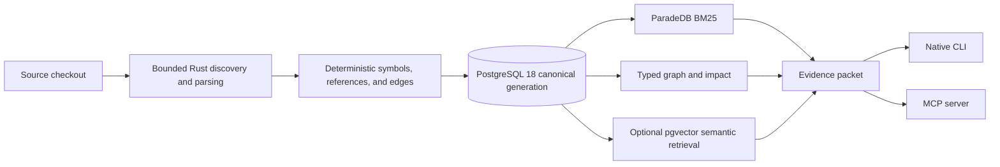

<div align="center">

# Cartograph

**Generation-safe code intelligence for AI coding agents.**

Native Rust CLI and MCP server · PostgreSQL 18 · code-aware BM25 · typed code graph

[](https://github.com/adder-factory/cartograph/releases/latest)
[](https://github.com/adder-factory/cartograph/actions/workflows/v2-rust.yml)
[](LICENSE)
[](https://www.rust-lang.org/)

[Quick start](#quick-start) · [Agent workflow](#agent-workflow) ·
[Architecture](#architecture) · [Documentation](#documentation)

</div>

---

Cartograph turns a source checkout into a searchable, immutable-generation code
graph. It gives coding agents compact evidence about declarations, references,
call flow, change impact, affected tests, and source freshness through one native
CLI and the [Model Context Protocol](https://modelcontextprotocol.io/).

The source checkout remains the source of truth. Every evidence packet carries
generation provenance, freshness, confidence, truncation, and explicit
abstention instead of presenting stale or incomplete data as certainty.

> [!IMPORTANT]
> Cartograph v2 is PostgreSQL-only. It requires PostgreSQL 18, ParadeDB
> `pg_search` 0.23.5, and pgvector. There is no SQLite runtime, compatibility
> mode, importer, optional feature, or fallback.

## What Cartograph gives an agent

| Question | Evidence |
| --- | --- |
| Where is this declared or referenced? | Exact symbol, path, reference, and identifier lookup |
| Which code is most relevant? | Code-aware BM25 over names, implementation identifiers, and documentation |
| What calls this, and what does it call? | Typed callers, callees, imports, references, and shortest paths |
| What could this change affect? | Bounded reverse impact and structurally connected tests |
| Is the graph current? | Immutable generation identity and exact supported-source freshness |
| What changed in the working tree? | Separately labeled live overlay and Git-ref review packets |
| Is an LLM required? | No for exact, lexical, graph, review, freshness, or affected-test workflows |

Cartograph also supports standard SCIP export, persistent per-file SCIP overlays,
model-scoped semantic retrieval, generated artifacts with explicit provenance,
and deterministic task-intent routing.

## Quick start

### 1. Install the native executable

macOS and Linux:

```sh
curl -fsSL https://raw.githubusercontent.com/adder-factory/cartograph/main/install.sh | sh
cartograph --version
```

Windows PowerShell:

```powershell
irm https://raw.githubusercontent.com/adder-factory/cartograph/main/install.ps1 | iex
cartograph --version
```

The installers select the native archive for the host, verify it against the
release `SHA256SUMS`, and place `cartograph` on the user PATH.

### 2. Build the first graph

On macOS or Linux with a local Docker daemon:

```sh
cd /path/to/project
cartograph db start --project-path .
cartograph doctor .
cartograph index .
cartograph status .
cartograph context 'explain the primary request flow' --project-path .
```

`db start` creates project-owned, loopback-only resources and pulls the pinned
upstream ParadeDB image. `doctor` fails closed unless PostgreSQL, pg_search,
pgvector, preload, BM25, migrations, and code tokenization all pass.

### 3. Connect a coding agent

Cartograph writes only project-local MCP configuration and pins the absolute
native executable path:

```sh
# OpenAI Codex
cartograph install --yes --target codex --location local --project-path .

# Claude Code
cartograph install --yes --target claude --location local --project-path .

# Cursor
cartograph install --yes --target cursor --location local --project-path .
```

Restart the agent host after registration or a binary upgrade.

### 4. Verify the live integration

A setup is ready only after all four signals pass:

1. `cartograph doctor` proves database capabilities.
2. `cartograph index` publishes one complete generation.
3. `cartograph status` reports that generation as fresh.
4. A real `find` or `context` query returns generation-scoped evidence.

A CLI request proves the executable and database path. After restarting an
agent host, make one live MCP request as the separate transport-health check.

> [!TIP]
> Prefer agent-assisted setup? Give your coding agent the task in
> [Agent-assisted installation](docs/AGENT-INSTALL.md).

## Platform and database support

| Host | Native release | Managed local database | External PostgreSQL |
| --- | ---: | ---: | ---: |
| macOS arm64 / x64 | Yes | Yes, with local Docker | Yes |
| Linux arm64 / x64 | Yes | Yes, with local Docker | Yes |
| Windows x64 | Yes | Not enabled | Yes |

For an external deployment, the database administrator installs PostgreSQL 18,
`pg_search` 0.23.5, and pgvector and creates both extensions. Load the connection
URL from the shell or a secret manager rather than a committed file:

```sh
export CARTOGRAPH_DATABASE_SCHEMA='cartograph_project'
# CARTOGRAPH_DATABASE_URL must already be present in the environment.

cartograph doctor /absolute/path/to/project
cartograph index /absolute/path/to/project
cartograph status /absolute/path/to/project
```

Database URLs are secrets. Public errors, debug output, MCP responses, archives,
and project records are required to omit credentials and absolute checkout
paths. See [PostgreSQL storage and operations](docs/STORAGE-BACKENDS.md).

## Agent workflow

A reliable coding loop starts with freshness, narrows with structural evidence,
and closes with impact-aware verification:

```sh
cartograph status .
cartograph context 'fix authentication token validation' --project-path .
cartograph find 'validateToken' --by name --project-path .
cartograph graph <symbol-id> --direction impact --project-path .
cartograph affected <symbol-id> --project-path .
cartograph review --ref main --project-path .
```

If status is stale, run `cartograph index .` or use the bounded MCP admin action.
Indexing unchanged source is a no-op; changed source publishes a complete new
generation atomically.

### Core MCP tools

| Tool | Purpose |
| --- | --- |
| `cartograph_status` | Current generation, counts, capability readiness, and freshness |
| `cartograph_find` | Exact name/path/reference lookup or code-aware BM25 |
| `cartograph_context` | Intent-aware evidence, graph context, and edit candidates |
| `cartograph_entry_points` | Routes, commands, MCP tools, exports, and API boundaries |
| `cartograph_graph` | Callers, callees, reverse impact, paths, and symbol similarity |
| `cartograph_affected` | Bounded affected-test selection |
| `cartograph_review` | Git-ref plus staged, unstaged, and untracked evidence |
| `cartograph_admin` | Explicit index, sync, embedding, and maintenance jobs |

MCP profiles are `coding`, `core`, `full`, `read-only`, and `review`. Profiles
have deterministic tool lists; a narrower profile cannot call hidden tools.

### CLI surface

```text
cartograph index [PROJECT]
cartograph status [PROJECT]
cartograph find <QUERY> --by name|path|reference|bm25
cartograph context <TASK> [--exact-name NAME] [--exact-path PATH]
cartograph entry-points [--bucket public-exports] [--limit 20]
cartograph graph <SYMBOL_ID> --direction callers|callees|both|impact
cartograph graph <SYMBOL_ID> --direction path --to <TARGET_SYMBOL_ID>
cartograph graph <SYMBOL_ID> --direction similar --k 5 --min-score 0.3
cartograph affected <SYMBOL_ID>
cartograph review --ref <GIT_REF>
cartograph serve --mcp [--profile coding|core|full|read-only|review]
cartograph doctor [PROJECT]
cartograph db <COMMAND>
cartograph install --yes --target <HOST>
cartograph uninstall --yes --target <HOST>
```

Text output is optimized for concise human diagnostics. JSON is the stable
automation surface where exposed by command help.

## Architecture



The architecture has a few hard boundaries:

- **Native runtime:** Rust owns discovery, parsing, resolution, bounded parallel
  indexing, retrieval, CLI, and MCP. No Bun, Node.js, or TypeScript runtime is
  shipped.
- **One durable store:** PostgreSQL 18 owns canonical project and generation
  state. ParadeDB BM25 and model-scoped HNSW are rebuildable derived indexes.
- **Atomic publication:** incomplete or unhealthy generations never become
  current. Readers query one verified immutable generation.
- **Deterministic concurrency:** 1, 2, 4, 8, and 16-worker builds reduce to the
  same logical digest and ordered evidence.
- **Optional generation:** exact lookup, BM25, graph, review, freshness, and
  affected tests work without an LLM. Generative output cannot replace
  structural truth.

For crate ownership, schemas, leases, retrieval, MCP boundaries, and failure
semantics, read the [v2 architecture](docs/v2/ARCHITECTURE.md).

## Language support

The stable registry production-admits 74 language modes and the complete 163
v1 extension manifest, plus additive Python `.pyi` support. Sixty-one modes use
pinned native tree-sitter grammars; thirteen mixed-markup, configuration, and
domain-specific modes use bounded Rust structural scanners.

Every admitted mode must prove deterministic facts, cancellation, literal
safety, parallel-worker identity, and live PostgreSQL/ParadeDB publication.
Unknown extensions are excluded rather than represented as a misleading empty
graph.

- [Language support matrix](docs/SUPPORT-MATRIX.md)
- [Native extraction architecture](docs/v2/EXTRACTION.md)
- [Add or extend a language](docs/EXTENDING-EXTRACTORS-RESOLVERS.md)

## Managed database operations

Common read-only or idempotent lifecycle commands:

```sh
cartograph db status --project-path .
cartograph db logs --project-path . --tail 200
cartograph db derived-index --project-path .
cartograph db backup ./cartograph.backup --project-path .
cartograph db stop --project-path .
```

Restore, upgrade, derived-index rebuild, removal, import, and prune can replace
or delete state. They require the exact confirmation phrase shown by command
help and are never implied by a diagnostic request.

Community ParadeDB BM25 is treated as rebuildable local derived data. Shared,
hosted, replicated, customer-facing, or paying production use requires a
separate durability and ParadeDB licensing decision.

## Migrating from v1.1.33

V2 imports only from a v1.1.33 PostgreSQL schema. It never opens or inspects a
SQLite graph.

If the only v1 index is SQLite, either rebuild v2 from the source checkout or
use the v1.1.33 binary to migrate SQLite to PostgreSQL first. The PostgreSQL v1
source and v2 destination must be distinct schemas in the same database.

Always back up the database, quiesce project writers, and run the non-mutating
preflight before the confirmed import:

```sh
cartograph db import-v1 \
  --project-path /absolute/path/to/checkout \
  --source-schema cartograph_v1 \
  --dry-run \
  --format json
```

The full resumable workflow, validation rules, and retention constraints are in
[PostgreSQL storage and operations](docs/STORAGE-BACKENDS.md#import-from-v1133-postgresql).

## Security and release guarantees

- Inputs, rows, bytes, tasks, output, deadlines, and retries have hard caps.
- User query text is bound data; dynamic schema identifiers use validated
  quoting paths.
- Source reads stay within a canonical project root and reject unsupported,
  oversized, or non-UTF-8 input.
- Write operations use PostgreSQL-clock leases, fencing tokens, advisory locks,
  bounded transactions, and rollback on lost ownership.
- Release archives contain only the native executable, README, license, and
  allowlisted third-party notices.
- Every stable release requires strict Rust gates, live PostgreSQL fault tests,
  deterministic worker benchmarks, Sonar, independent review, five native
  archive audits, checksums, provenance, and a signed tag at published `main`.

Cartograph does not bundle PostgreSQL, ParadeDB, pgvector, an extension package,
or a container image. See the [distribution and licensing policy](docs/v2/LICENSING.md).

## Documentation

| Guide | Use it for |
| --- | --- |
| [Agent-assisted installation](docs/AGENT-INSTALL.md) | A copy-paste setup task for a coding agent |
| [CLI reference](docs/CLI-REFERENCE.md) | Commands, flags, JSON output, and exit behavior |
| [MCP usage](docs/MCP-USAGE.md) | Profiles, tools, transport, and host integration |
| [Configuration](docs/CONFIGURATION.md) | Database, retrieval, LLM, and bounded runtime settings |
| [Architecture](docs/v2/ARCHITECTURE.md) | Crate ownership, generations, retrieval, leases, and trust boundaries |
| [Storage operations](docs/STORAGE-BACKENDS.md) | Managed/external PostgreSQL, migration, recovery, and retention |
| [Performance tuning](docs/PERF-TUNING.md) | Worker, connection, timeout, and indexing guidance |
| [Troubleshooting](docs/TROUBLESHOOTING.md) | Docker, PostgreSQL, pg_search, pgvector, and MCP failures |
| [Release benchmarks](docs/v2/benchmarks/) | Determinism, scaling, and patch-task evidence |

## Development

The repository pins its Rust toolchain in `rust-toolchain.toml`.

```sh
git clone https://github.com/adder-factory/cartograph.git
cd cartograph
cargo build --locked --release -p cartograph-cli

cargo fmt --all --check
cargo clippy --locked --workspace --all-targets --all-features -- -D warnings
cargo test --locked --workspace
cargo deny --all-features check
```

The complete live PostgreSQL/ParadeDB gate is defined in
[`v2-rust.yml`](.github/workflows/v2-rust.yml). Release tags rebuild and smoke
macOS arm64/x64, Linux arm64/x64, and Windows x64 archives before checksums,
provenance, and immutable publication.

## License

Cartograph is licensed under the [MIT License](LICENSE). Third-party components
retain their own licenses; see [ACKNOWLEDGEMENTS.md](ACKNOWLEDGEMENTS.md) and the
[ParadeDB distribution boundary](docs/v2/LICENSING.md).
