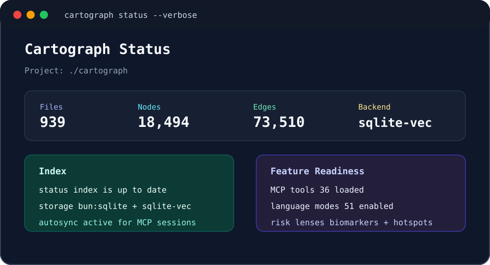
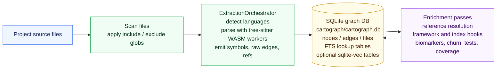
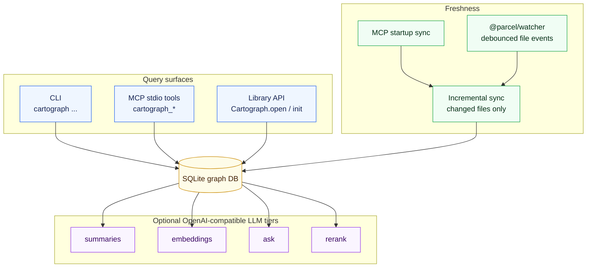

<div align="center">

# Cartograph

### Semantic Code Intelligence for AI Coding Agents

**Fewer tool calls · Faster exploration · Local-first by default**

[](https://opensource.org/licenses/MIT)
[](https://bun.sh)
[](#other-mcp-clients)
[](#how-it-works)

[](#)
[](#)
[](#)

<p>
  <a href="#install">Install</a> ·
  <a href="#configure-agents">Configure Agents</a> ·
  <a href="#initialize-a-project">Initialize</a> ·
  <a href="#mcp-tools">MCP Tools</a> ·
  <a href="#token-savings-benchmark">Benchmarks</a> ·
  <a href="#cli-reference">CLI</a> ·
  <a href="#supported-languages--file-formats">Languages</a>
</p>

<br />

</div>

Cartograph builds a local SQLite knowledge graph of your codebase and exposes it to MCP-compatible agents. Instead of repeatedly scanning files, agents can ask structured questions about symbols, call graphs, changed tests, hotspots, and code health.

It works with Claude Code, Cursor, Codex CLI, opencode, Hermes, Gemini CLI, Antigravity, Kiro, and any client that can start a stdio MCP server.

> Cartograph is a fork of [codegraph](https://github.com/colbymchenry/codegraph) by Colby Mchenry, used under the MIT License. It keeps the local graph-indexing foundation and adds optional OpenAI-compatible HTTP tiers for embedding, chat, summaries, and rerank. See [ACKNOWLEDGEMENTS.md](./ACKNOWLEDGEMENTS.md) for full credits.

## Start Here

| Step | Command | Result |
|---|---|---|
| 1. Install from source | `git clone ... && cd cartograph && bun install && bun link` | Puts `cartograph` on PATH |
| 2. Configure your agent | `cartograph install` | Writes MCP config for supported clients |
| 3. Index a project | `cartograph admin init -i` | Creates `.cartograph/` and builds the graph |
| 4. Check readiness | `cartograph status --verbose` | Shows freshness, hotspots, biomarkers, and feature readiness |

| What you need | Where to go |
|---|---|
| Agent setup details | [Configure Agents](#configure-agents) |
| LLM-backed features | [Initialize a Project](#initialize-a-project) |
| Non-built-in MCP clients | [Other MCP Clients](#other-mcp-clients) |
| Full command catalog | [CLI Reference](#cli-reference) |

## 60-Second Quickstart

```bash
git clone https://github.com/adder-factory/cartograph.git
cd cartograph
bun install
bun link

cd /path/to/your/project
cartograph admin init -i
cartograph status --verbose
```

That gives you a local graph index immediately. Run `cartograph install` when you want an AI agent to use the same graph through MCP.

## At A Glance

| Area | What Cartograph does |
|---|---|
| Graph index | Stores files, symbols, edges, references, metrics, and derived signals in local SQLite |
| Query surfaces | Exposes the same graph through CLI commands, MCP stdio tools, and a library API |
| Freshness | Runs MCP startup sync and debounced file-watch sync through `@parcel/watcher` |
| Code health | Computes biomarkers, hotspots, churn, coverage joins, dependency audits, and risk reviews |
| Optional LLMs | Adds summaries, embeddings, semantic search, ask, and rerank through OpenAI-compatible HTTP providers |
| Agent support | Installer targets Claude Code, Cursor, Codex CLI, opencode, Hermes, Gemini CLI, Antigravity, and Kiro |

> **No LLM required for the core graph.** Indexing, symbol search, call graphs, impacted tests, biomarkers, hotspots, dependency audits, and CLI/MCP operation run without an LLM. LLMs are optional and only power summaries, embeddings, semantic search, `ask`, and rerank.

## Status Snapshot

<p align="center">
  
</p>

## Install

Cartograph runs on [Bun](https://bun.sh) >= 1.3. It is distributed from source for now; the npm package is not published yet.

> Until npm publishing is enabled, install from a source checkout and use `bun link`. The interactive installer uses the same source-linked command when it wires agents to Cartograph.

```bash
git clone https://github.com/adder-factory/cartograph.git
cd cartograph
bun install
bun link
```

That puts the `cartograph` command on your PATH.

## Configure Agents

Run the installer once. It detects installed agents, writes their MCP config, and adds Cartograph usage instructions where the agent supports them.

```bash
cartograph install
```

The installer can configure:

| Target | Files managed |
|---|---|
| Claude Code | MCP entry, optional permissions, and `CLAUDE.md` instructions (`~/.claude...` or project-local equivalents) |
| Cursor | MCP entry (`~/.cursor/mcp.json` or `.cursor/mcp.json`); project-local installs also write `.cursor/rules/cartograph.mdc` |
| Codex CLI | `~/.codex/config.toml`, `~/.codex/AGENTS.md` |
| opencode | `~/.config/opencode/opencode.json` or project-local `opencode.json` |
| Hermes | `$HERMES_HOME/config.yaml`, falling back to `~/.hermes/config.yaml` |
| Gemini CLI | MCP entry plus `GEMINI.md` instructions (`~/.gemini...` or project-local equivalents) |
| Antigravity | `~/.gemini/config/mcp_config.json` or legacy `~/.gemini/antigravity/mcp_config.json` |
| Kiro | MCP entry plus steering instructions (`~/.kiro...` or project-local equivalents) |

Non-interactive examples:

```bash
cartograph install --yes
cartograph install --target=cursor,claude --yes
cartograph install --target=auto --location=local
cartograph install --print-config codex
```

| Flag | Values | Default |
|---|---|---|
| `--target` | `auto`, `all`, `none`, or csv (`claude,cursor,...`) | prompt |
| `--location` | `global`, `local` | prompt |
| `--yes` | Use defaults for scripting | prompt every step |
| `--no-permissions` | Skip Claude auto-allow list | permissions on |
| `--print-config <id>` | Print one target snippet and exit | - |

Restart your agent after installation so it loads the MCP server.

## Initialize a Project

From the project you want indexed:

```bash
cd your-project
cartograph admin init -i
```

For LLM-backed features such as summaries, semantic search, ask, and rerank, configure an OpenAI-compatible backend. `doctor --fix` creates `.cartograph/`, downloads missing GGUF models for the recommended llama-cpp path, writes a starter config, and prints the backend commands you still need to start manually.

```bash
cartograph doctor --fix /path/to/your/project

# Start the printed backend commands, then verify:
cartograph doctor /path/to/your/project
```

Common backend choices:

| Backend | Good for |
|---|---|
| Ollama | Simple local setup; models load on demand |
| llama-cpp `llama-server` | Explicit per-tier local servers; best control |
| Apple MLX / LM Studio / vLLM / LocalAI | Any OpenAI-compatible local endpoint |
| Cloud OpenAI-compatible provider | When you prefer hosted chat, embedding, or rerank tiers |

## Key Features

| | |
|---|---|
| **Smart Context Building** | One tool call returns entry points, related symbols, and code snippets for a task |
| **Full-Text + Intent Search** | Find code by name, regex, env var, SQL table, semantic similarity, or summary intent |
| **Impact Analysis** | Trace callers, callees, and the full impact radius of any symbol before making changes |
| **Fresh Indexes** | Native file watching keeps the graph current with debounced auto-sync |
| **Broad Language Coverage** | 36 language modes, including TS/JS, Python, Go, Rust, Java, C/C++, C#, Ruby, PHP, Swift, Kotlin, Scala, Vue, Svelte, SQL, GraphQL, HCL, Prisma, XML, YAML, and more |
| **Local-First Architecture** | Source indexing and graph storage stay local; LLM tiers can be local or cloud-hosted |

## Terminal Examples

```bash
$ cartograph status --verbose
Cartograph Status
Project: /path/to/project
Files: 939    Nodes: 18,494    Edges: 73,510
Backend: bun:sqlite + sqlite-vec
Index: up to date
```

```bash
$ cartograph find "readReviewDiffInput" --by name --mode exact
readReviewDiffInput  function  src/bin/commands/review.ts:25
```

```bash
$ cartograph review risk --top-n 3
# Risk review
- Biomarkers: highest-severity findings first
- Hotspots: high centrality x churn files
- Coverage gaps: structurally important low-coverage symbols
```

```bash
$ cartograph review trust
# Trust self-check
- Freshness: whether the graph is current enough for broad analysis
- Coverage: whether LCOV data is loaded
- LLMs: whether ask, summary, and embedding tiers are configured
```

<details>
<summary><strong>Manual Setup (Alternative)</strong></summary>

**Install from source:**
```bash
git clone https://github.com/adder-factory/cartograph.git && cd cartograph && bun install && bun link
```

**Add to `~/.claude.json`:**
```json
{
  "mcpServers": {
    "cartograph": {
      "type": "stdio",
      "command": "cartograph",
      "args": ["serve", "--mcp"]
    }
  }
}
```

**Add to `~/.claude/settings.json` (optional, for auto-allow):**
```json
{
  "permissions": {
    "allow": [
      "mcp__cartograph__cartograph_find",
      "mcp__cartograph__cartograph_context",
      "mcp__cartograph__cartograph_graph",
      "mcp__cartograph__cartograph_node",
      "mcp__cartograph__cartograph_at_range",
      "mcp__cartograph__cartograph_status"
    ]
  }
}
```

</details>

<details>
<summary><strong>Global Instructions Reference</strong></summary>

The installer writes these instructions into each target's agent-instructions file where supported:

```markdown
## Cartograph

Cartograph builds a semantic knowledge graph of codebases for faster, smarter code exploration.

### If `.cartograph/` exists in the project

The dividing line for WHERE to call a tool is **output source-volume** — does the call return full source bodies into your context?

**Source-dumping tools — `cartograph_explore`, `cartograph_context`, `cartograph_node({code: true})` — return large source sections. Don't call them directly in the main session; spawn an Explore agent** for any exploration question (e.g., "how does X work?", "explain the Y system", "where is Z implemented?") so the source lands in a disposable sub-agent context and only the distilled answer returns.

**When spawning Explore agents**, include this instruction in the prompt:

> This project has Cartograph initialized (.cartograph/ exists). Use `cartograph_explore` as your PRIMARY tool — it returns full source code sections from all relevant files in one call.
>
> **Rules:**
> 1. Follow the explore call budget in the `cartograph_explore` tool description — it scales automatically based on project size.
> 2. Do NOT re-read files that cartograph_explore already returned source code for. The source sections are complete and authoritative.
> 3. Only fall back to grep/glob/read for files listed under "Additional relevant files" if you need more detail, or if cartograph returned no results.

**The metadata-only tools return compact structured data — call them directly in the main session** (targeted lookups before making edits, not full exploration):

For the smallest useful output, pass `lowTokens: true` in MCP or `--low-tokens` in the CLI for supported high-volume tools: `cartograph_find`, `cartograph_graph`, `cartograph_context`, `cartograph_explore`, `cartograph_at_range`, `cartograph_node`, `cartograph_files`, and `cartograph_imports`. This applies compact rows, narrower fields, lower caps, or source suppression depending on the tool. Server operators can make this the default for supported MCP tools with `cartograph serve --mcp --low-tokens-default`; callers can still pass `lowTokens: false` for one regular response.

If you control the MCP server launch, run `cartograph mcp-budget` to measure startup load. `cartograph serve --mcp --profile core`, `--profile read-only`, `--no-write-tools`, and repeated `--disable-tool <name>` reduce the advertised tool list loaded at connection time.

| Tool | Use For |
|------|----------|
| `cartograph_find` | Find symbols by name / regex / env-var / SQL ref (`by:` slice + `mode:`) |
| `cartograph_graph({direction: 'callers'\|'callees'})` | Trace call flow |
| `cartograph_graph({direction: 'impact'})` | Check what's affected before editing |
| `cartograph_node` | A single symbol's details (omit `code: true` to stay metadata-only) |
| `cartograph_at_range` | Symbols overlapping a file:line span (PR-review hunks) |
| `cartograph_biomarkers` / `cartograph_status` | Risk findings per symbol / index health |

### If `.cartograph/` does NOT exist

At the start of a session, ask the user if they'd like to initialize Cartograph:

"I notice this project doesn't have Cartograph initialized. Would you like me to run `cartograph admin init -i` to build a code knowledge graph?"
```

</details>

---

## How It Works





1. **Extraction** — `ExtractionOrchestrator` scans included files, detects languages, and parses source with [tree-sitter](https://tree-sitter.github.io/) WASM grammars. Language-specific extractors emit files, symbols, raw edges, and unresolved references.

2. **Storage** — The graph is stored in a local SQLite database (`.cartograph/cartograph.db`) with FTS-backed lookup tables and optional `sqlite-vec` tables for vector features.

3. **Enrichment** — After extraction, Cartograph resolves references and runs index hooks for derived signals such as framework edges, tests, churn, co-change, coverage, centrality, and biomarkers.

4. **Query Surfaces** — CLI commands, MCP tools, and the library API all read the same graph. Tools such as `cartograph_find`, `cartograph_graph`, `cartograph_review`, and `cartograph_status` are structured query layers over the database.

5. **Auto-Sync** — The MCP server runs a startup sync, then watches your project through `@parcel/watcher`. Changes are debounced, filtered to indexable files, and incrementally synced.

6. **Optional LLM Tiers** — Summaries, embeddings, semantic search, `ask`, and rerank use OpenAI-compatible HTTP providers configured in `.cartograph/config.json`. The core index and graph queries do not require an LLM.

---

## CLI Reference

```bash
cartograph                         # Run interactive installer
cartograph install                 # Run installer (explicit)
cartograph setup [path]            # One-shot bootstrap: admin init + install-models + doctor (--minimal, --no-models)
cartograph doctor [path]           # Diagnose install state (--fix to auto-apply remediations)
cartograph admin init [path]       # Initialize in a project (-i / --index to also index)
cartograph admin uninit [path]     # Remove Cartograph from a project (--force to skip prompt)
cartograph admin index [path]      # Full (re)index of the project
cartograph admin sync [path]       # Incremental update
cartograph status [path]           # Show index status and statistics
cartograph find [query]            # Find symbols by name / regex / env-var / SQL ref (--by, --mode, --kind, --limit)
cartograph ask <question> [path]   # Ask a natural-language question about the codebase (needs an LLM)
cartograph llm                     # Local LLM setup utilities
cartograph digest                  # "Land in a new repo" overview — hotspots, health, entry points
cartograph files [dir]             # Show file structure (--format, --pattern, --max-depth, --json)
cartograph context <task>          # Build context for AI (--format, --max-nodes)
cartograph affected [files...]     # Find test files affected by changes (see below)
cartograph review <subcommand>     # context / neighbors / risk / agent-audit / trust
cartograph serve --mcp             # Start MCP server
```

Additional query and maintenance commands are available for deeper workflows:

```bash
cartograph at-range                # Symbols overlapping file:line ranges or diff hunks
cartograph graph                   # Call/dependency graph traversal
cartograph node                    # Symbol details, optionally with code and related data
cartograph biomarkers              # Static-analysis findings and Code Health
cartograph coverage                # Coverage joined to symbols
cartograph hotspots                # Churn × centrality file triage
cartograph dead-code               # Potentially-dead symbol candidates
cartograph deps                    # package.json dependency audit
cartograph tests-for               # Tests covering a symbol or files
cartograph entry-points            # Routes, CLI commands, MCP tools, and public exports
cartograph changed-since           # File drift since index time or a supplied timestamp
cartograph compare-to-ref          # End-of-task structural and finding delta
cartograph trace-to-culprits       # Stack trace → likely fix sites
cartograph imports                 # Import statement audit
cartograph sql                     # Read-only SQL escape hatch
cartograph explore                 # Deep topic exploration
cartograph module                  # Directory/module summary
cartograph role                    # Symbol role classification
cartograph blame                   # Symbol-level git blame
cartograph history                 # Symbol-level co-change
cartograph similar                 # Embedding-cosine peers
cartograph propose-rename          # Rename plan with call sites and mentions
cartograph note                    # Persistent notes/bookmarks
cartograph session                 # Session state and macros
cartograph summaries               # Agent-bridge summary pull/save
cartograph local-chat              # Delegate bulk prose to local LLM
cartograph discover                # Find other .cartograph indexes
cartograph playbook                # Print the MCP tool playbook
cartograph mcp-budget              # Measure MCP tools/list + initialize load
cartograph viewer                  # Open the local graph viewer
```

### `cartograph affected`

Traces import dependencies transitively to find which test files are affected by changed source files.

```bash
cartograph affected                                  # Derive changed files from git diff HEAD
cartograph affected src/utils.ts src/api.ts         # Pass files as arguments
git diff --name-only | cartograph affected --stdin   # Pipe from git diff
cartograph affected src/auth.ts --filter "e2e/*"     # Custom test file pattern
```

| Option | Description | Default |
|--------|-------------|---------|
| `-p, --project-path <path>` | Project path | current directory |
| `--files <paths...>` | Alias for the positional file arguments | — |
| `--stdin` | Read file list from stdin | `false` |
| `-d, --depth <n>` | Max dependency traversal depth | `5` |
| `-f, --filter <glob>` | Custom glob to identify test files | auto-detect |
| `--include-tests` | Include test-file targets while walking dependents; affected output still reports tests | `false` |
| `-j, --json` | Output as JSON | `false` |
| `-q, --quiet` | Output file paths only | `false` |

Paths passed explicitly that aren't in the index are rejected with an error and a non-zero exit code.

**CI/hook example:**

```bash
#!/usr/bin/env bash
AFFECTED=$(git diff --name-only HEAD | cartograph affected --stdin --quiet)
if [ -n "$AFFECTED" ]; then
  npx vitest run $AFFECTED
fi
```

---

## MCP Tools

When running as an MCP server, Cartograph exposes 36 tools to any MCP-compatible AI assistant. Most sessions start with the same small set:

| Start With | Use It When You Need |
|---|---|
| `cartograph_status` | A quick health check, index stats, feature readiness, and optional hotspot / biomarker rollups |
| `cartograph_find` | Symbols, regex content, env-var reads, or SQL references |
| `cartograph_graph` | Callers, callees, blast radius, shortest paths, or embedding-similar symbols |
| `cartograph_node` | One symbol's signature, summary, source preview, callers, callees, tests, or biomarkers |
| `cartograph_context` | Task-shaped context when an agent needs relevant code for an implementation or bug |
| `cartograph_review` | Diff review, sister implementations, risk triage, trust self-checks, or agent-prone biomarker audit |

### MCP Load Context

MCP clients request `tools/list` when the server starts, and many clients place those tool names, descriptions, and input schemas into the model's available-tool context. Cartograph compacts the advertised descriptions before returning `tools/list` and keeps the MCP `initialize` instructions to a short first-tool guide; call `cartograph_playbook` when an agent needs the full tool-selection playbook. On this repository, the full 36-tool list serializes to about 64 KB, or roughly 16k estimated tokens using the same characters / 4 estimator as the benchmark below. Including the compact initialize guide, the measured MCP load context is about 66 KB, or 16.5k estimated tokens.

Measure the current surface with `cartograph mcp-budget` or `bun run measure:mcp-load`. The report includes tool count, `tools/list`, initialize, combined startup load, the on-demand full playbook size, and the largest schema contributors. Pass `--profile`, `--no-write-tools`, `--disable-tool`, `--top`, or `--json` to inspect a specific server shape.

That startup schema cost is separate from per-call output tokens, so `lowTokens: true` and `--low-tokens-default` reduce tool results but do not shrink the advertised tool list.

For focused or read-only agents, trim the advertised surface at server launch:

```bash
cartograph serve --mcp --profile core
cartograph serve --mcp --profile review
cartograph serve --mcp --no-write-tools
cartograph serve --mcp --disable-tool cartograph_ask --disable-tool cartograph_local_chat
```

Profiles are advertised-tool filters: `full` is the default 36-tool surface, `core` keeps common coding-agent lookup and change-impact tools, `review` focuses diff/risk/test workflows, and `read-only` removes write-class tools. Profiles compose with `--no-write-tools` and repeated `--disable-tool <name>`.

In the same measurement, `--no-write-tools` reduced the list to 31 tools and about 13.6k estimated tokens including initialize instructions. The registry test guards both limits: no more than 45 advertised tools, no more than 65 KB of serialized `tools/list` schema, and no more than 68 KB total for `tools/list` plus initialize instructions.

### Token Savings Benchmark

Supported high-volume tools accept `lowTokens: true` over MCP and `--low-tokens` on the matching CLI commands: `cartograph_find`, `cartograph_graph`, `cartograph_context`, `cartograph_explore`, `cartograph_at_range`, `cartograph_node`, `cartograph_files`, and `cartograph_imports`. MCP servers can also launch with `--low-tokens-default` so supported tools behave as if `lowTokens: true` was passed unless a call explicitly passes `lowTokens: false`. In a local measurement on this repository, `lowTokens: true` reduced representative MCP response output by about 57% versus regular Cartograph output, with source-heavy exploration cases saving roughly 78-89%.

Re-run the benchmark with `bun run benchmark:tokens`. Token counts below are estimated as characters / 4, so treat them as directional rather than tokenizer-exact:

| Case | Regular Cartograph | `lowTokens: true` | `rg` / grep-style baseline | Savings |
|---|---:|---:|---:|---|
| `find handleFind` | ~345 | ~172 | ~881 | ~50% less vs regular, ~80% less vs baseline |
| `graph callers handleFind` | ~42 | ~37 | no fair grep equivalent | ~12% less vs regular |
| `context` for `cartograph_find` dispatch | ~2,307 | ~513 | ~3,752 | ~78% less vs regular, ~86% less vs baseline |
| `explore handleFind/findSchema/forwardNameArgs` | ~8,750 | ~937 | ~3,752 | ~89% less vs regular, ~75% less vs baseline |
| `at_range` on `find.ts` dispatch lines | ~55 | ~25 | ~616 | ~55% less vs regular, ~96% less vs baseline |
| `node` batch for find-tool symbols | ~617 | ~534 | ~327 | ~13% less vs regular, ~63% more vs baseline |
| `files` project overview | ~3,745 | ~822 | ~8,817 | ~78% less vs regular, ~91% less vs baseline |
| `imports` project audit | ~3,338 | ~671 | ~241,102 | ~80% less vs regular, ~100% less vs baseline |

Exact single-file text search can still be cheaper when you already know the file and string. Cartograph's savings show up when the agent needs structured context instead of raw matching source lines.

### Tool Families

| Family | Tools | Try |
|---|---|---|
| Explore | `cartograph_find`, `cartograph_files`, `cartograph_node`, `cartograph_graph`, `cartograph_context`, `cartograph_digest`, `cartograph_explore`, `cartograph_module`, `cartograph_ask`, `cartograph_local_chat` | [`cartograph find`](#terminal-examples), `cartograph graph`, `cartograph context` |
| Review & Risk | `cartograph_review`, `cartograph_biomarkers`, `cartograph_coverage`, `cartograph_hotspots`, `cartograph_dead_code`, `cartograph_deps`, `cartograph_trace_to_culprits` | [`cartograph review risk`](#terminal-examples), `cartograph biomarkers` |
| Tests & Change Impact | `cartograph_affected`, `cartograph_tests_for`, `cartograph_compare_to_ref`, `cartograph_changed_since`, `cartograph_at_range`, `cartograph_entry_points` | [`cartograph affected`](#cartograph-affected), `cartograph compare-to-ref` |
| History & Refactors | `cartograph_blame`, `cartograph_history`, `cartograph_propose_rename`, `cartograph_imports`, `cartograph_sql` | `cartograph blame`, `cartograph propose-rename` |
| Operations | `cartograph_status`, `cartograph_admin`, `cartograph_playbook`, `cartograph_session`, `cartograph_note`, `cartograph_summaries`, `cartograph_role`, `cartograph_discover` | [`cartograph status`](#terminal-examples), `cartograph playbook` |

The full 36-tool server is intentionally broader than the first six tools above, but the families keep related workflows close together. Call `cartograph_playbook` or run `cartograph playbook` for the complete tool contract, argument shapes, and selection guidance.

### CLI / MCP Pairings

| Need | CLI | MCP |
|---|---|---|
| Find symbols, regex content, env vars, or SQL refs | `cartograph find` | `cartograph_find` |
| Trace callers, callees, impact, or symbol paths | `cartograph graph` | `cartograph_graph` |
| Gather task-specific code context | `cartograph context` | `cartograph_context` |
| Review a diff, inspect project risk, or check analysis readiness | `cartograph review` | `cartograph_review` |
| Check index health and project rollups | `cartograph status --verbose` | `cartograph_status({ verbose: true })` |
| Find tests affected by source edits | `cartograph affected` | `cartograph_affected` |
| Compare the final worktree to a ref | `cartograph compare-to-ref` | `cartograph_compare_to_ref` |

### Example Agent Prompts

```text
Use Cartograph to find the riskiest code touched by my current diff and tell me what tests to run.
```

```text
Before editing auth, use Cartograph to inspect callers, hotspots, biomarkers, and related tests.
```

```text
Review this diff with Cartograph for blast radius, sister implementations, and co-change warnings.
```

```text
Use Cartograph to find where billing routes enter the system, then summarize the implementation path.
```

---

## Other MCP Clients

The MCP server runs over **stdio** and works with any MCP-compatible client — not just Claude Code. The interactive installer can write configs for the built-in targets; use the manual setup below for clients outside that list or for hand-managed configs.

**Common steps for every client:**

```bash
# install Cartograph from source first (see Install) so `cartograph` is on PATH
cd your-project
cartograph admin init -i                     # initialize + index this project
```

Then point your MCP client at `cartograph serve --mcp` using whatever config shape it expects:

### opencode

In `opencode.json` (project) or `~/.config/opencode/opencode.json` (global):

```json
{
  "$schema": "https://opencode.ai/config.json",
  "mcp": {
    "cartograph": {
      "type": "local",
      "command": ["cartograph", "serve", "--mcp"],
      "enabled": true
    }
  }
}
```

### Cursor

In `~/.cursor/mcp.json` (global) or `.cursor/mcp.json` (project):

```json
{
  "mcpServers": {
    "cartograph": {
      "type": "stdio",
      "command": "cartograph",
      "args": ["serve", "--mcp"]
    }
  }
}
```

### LangChain (`MultiServerMCPClient`)

The Cartograph server speaks stdio, not SSE — pass `transport: "stdio"`:

```python
from langchain_mcp_adapters.client import MultiServerMCPClient

client = MultiServerMCPClient({
    "cartograph": {
        "command": "cartograph",
        "args": ["serve", "--mcp"],
        "transport": "stdio",
    }
})
tools = await client.get_tools()
```

### Claude Agent SDK

Pass the server in `mcpServers` (TypeScript) or `mcp_servers` (Python) when calling `query()`:

```python
from claude_agent_sdk import query, ClaudeAgentOptions

options = ClaudeAgentOptions(
    mcp_servers={
        "cartograph": {
            "command": "cartograph",
            "args": ["serve", "--mcp"],
        }
    },
    allowed_tools=["mcp__cartograph__*"],
)

async for message in query(prompt="Where is auth handled?", options=options):
    ...
```

### Anything else (generic stdio MCP)

Most MCP clients (Continue, Zed, custom integrations, etc.) accept some variation of `command` + `args`. The values are always:

| Field | Value |
|-------|-------|
| Command | `cartograph` |
| Args | `["serve", "--mcp"]` |
| Transport | `stdio` |

The server reads the project root from the MCP `initialize` request's `rootUri` (set by the client when it connects). If your client doesn't send a `rootUri`, pass the project path explicitly:

```bash
cartograph serve --mcp --project-path /absolute/path/to/project
```

Useful server controls:

```bash
cartograph serve --mcp --profile core
cartograph serve --mcp --profile read-only
cartograph serve --mcp --no-write-tools
cartograph serve --mcp --allow-stale-default
cartograph serve --mcp --low-tokens-default
cartograph serve --mcp --disable-tool cartograph_ask
cartograph serve --mcp --no-startup-sync
```

> **Note:** Cartograph's MCP server does **not** speak SSE/HTTP. If your client only supports `url` + `transport: "sse"`, you'll need to wrap stdio with a bridge like [supergateway](https://github.com/supercorp-ai/supergateway).

---

## Library Usage

```typescript
import Cartograph from '@adder-factory/cartograph';

// Initialize a fresh index, or open an existing one:
const cg = await Cartograph.init('/path/to/project');
// const cg = await Cartograph.open('/path/to/project');

await cg.indexAll({
  onProgress: (p) => console.log(`${p.phase}: ${p.current}/${p.total}`),
});

// Look up symbols, then traverse the graph via the typed accessors:
const [node] = cg.queries.getNodesByFile('src/auth/login.ts');
const callers = cg.internals.traverser.getCallers(node.id);
const impact = cg.internals.traverser.getImpactRadius(node.id, 2);
const context = await cg.internals.contextBuilder.buildContext('fix login bug', {
  maxNodes: 20,
  includeCode: true,
});

await cg.sync();      // incremental update
cg.watcher.start();   // auto-sync on file changes
cg.watcher.stop();    // stop watching
cg.close();
```

---

## Configuration

The `.cartograph/config.json` file controls indexing and derived-signal passes. A minimal hand-authored config usually only needs overrides; omitted fields fall back to the built-in defaults.

```json
{
  "version": 1,
  "rootDir": ".",
  "languages": ["typescript", "javascript"],
  "exclude": ["**/node_modules/**", "**/dist/**", "**/build/**", "**/*.min.js"],
  "frameworks": [],
  "maxFileSize": 5242880,
  "extractDocstrings": true,
  "trackCallSites": true,
  "enableCentrality": true,
  "enableChurn": true,
  "enableCoChange": true
}
```

| Option | Description | Default |
|--------|-------------|---------|
| `rootDir` | Root directory relative to the project path | `"."` |
| `include` | Glob patterns to index; derived from the language registry if omitted | language defaults |
| `languages` | Languages to index (auto-detected if empty) | `[]` |
| `exclude` | Glob patterns to ignore | dependency, build, cache, fixture, and generated-output defaults |
| `maxFileSize` | Skip files larger than this (bytes) | `5242880` (5MB) |

<details>
<summary><strong>Advanced config options</strong></summary>

| Option | Description | Default |
|--------|-------------|---------|
| `frameworks` | Framework hints for extraction/resolution | `[]` |
| `extractDocstrings` | Extract docstrings from code | `true` |
| `trackCallSites` | Track call site locations | `true` |
| `enableCentrality` / `enableBetweenness` | Compute graph centrality signals; betweenness is opt-in | `true` / `false` |
| `enableChurn` / `enableIssueHistory` / `enableCoChange` | Mine git-derived change signals | `true` |
| `enableConfigRefs` / `enableSqlRefs` / `enableBuildContextRefs` / `enableStringImports` | Add derived reference edges from non-call domains | `true` |
| `indexSubmodules` | Recurse into git submodules | `true` |
| `dependenciesAllowlist` | Packages never flagged by `cartograph deps` | `[]` |

</details>

## What Cartograph Is Not

| Expectation | Reality |
|---|---|
| Hosted SaaS | Cartograph is local-first; the graph database lives under `.cartograph/` in your project |
| Test replacement | It helps find affected tests and risk areas, but your test suite remains the source of truth |
| LLM-only reviewer | Review tools are deterministic graph queries first; LLM features are optional enrichment |
| Cloud dependency | Core indexing and graph tools work offline after dependencies are installed |

## Supported Languages & File Formats

Cartograph currently supports **36 language modes**. Frameworks and embedded DSLs are listed separately below so the core language matrix stays readable.

<details>
<summary><strong>Show language matrix</strong></summary>

| Language | Extension | Status |
|----------|-----------|--------|
| TypeScript | `.ts`, `.mts`, `.cts` | Full support |
| TSX | `.tsx` | Full support |
| JavaScript | `.js`, `.mjs`, `.cjs` | Full support |
| JSX | `.jsx` | Full support |
| Python | `.py`, `.pyw` | Full support |
| Go | `.go` | Full support |
| Rust | `.rs` | Full support |
| Java | `.java` | Full support |
| C# | `.cs` | Full support |
| PHP | `.php`, `.module`, `.install`, `.theme`, `.inc` | Full support |
| Ruby | `.rb`, `.rake` | Full support |
| C | `.c`, `.h` | Full support |
| C++ | `.cpp`, `.cc`, `.cxx`, `.hpp`, `.hxx` | Full support |
| Objective-C | `.m`, `.mm` | Full support (multi-keyword selector reconstruction, React-Native/Expo bridging) |
| Swift | `.swift` | Full support |
| Kotlin | `.kt`, `.kts` | Full support |
| Dart | `.dart` | Full support |
| Svelte | `.svelte` | Full support (script extraction, Svelte 5 runes, SvelteKit routes) |
| Vue | `.vue` | Full support (Single-File Components — `<script>` / `<script setup>` extraction) |
| Liquid | `.liquid` | Full support |
| Pascal / Delphi | `.pas`, `.dpr`, `.dpk`, `.lpr`, `.dfm`, `.fmx` | Full support (classes, records, interfaces, enums, DFM/FMX form files) |
| Scala | `.scala`, `.sc` | Full support |
| ReScript | `.res`, `.resi` | Full support |
| R | `.r`, `.R` | Full support |
| Lua | `.lua` | Full support (`function M:foo()` colon syntax → `method` nodes) |
| Elixir | `.ex`, `.exs` | Baseline support via the `tags.scm` fallback extractor (definitions + call references) |
| Bash | `.sh`, `.bash` | Full support (functions, variables, command calls) |
| Zsh | `.zsh`, `.zshrc`, `.zshenv`, `.zprofile`, `.zlogin` | Full support (functions, variables, command calls) |
| Fish | `.fish` | Full support (functions, variables, command calls) |
| GraphQL | `.graphql`, `.gql` | Full support (SDL — types, fields, enums, interfaces) |
| SQL | `.sql`, `.ddl`, `.dml` | Full support (DDL — tables, views, functions, foreign keys) |
| HCL / Terraform | `.tf`, `.tfvars`, `.hcl` | Full support (resources, variables, outputs) |
| Prisma | `.prisma` | Full support (models, composite types, enums → struct / field / enum_member) |
| Java Properties | `.properties` | Full support (configuration keys and values) |
| XML (MyBatis) | `.xml` | Scoped support for MyBatis mapper/config files |
| YAML | `.yaml`, `.yml` | Grammar-loaded support for framework route/config resolvers |

</details>

## Framework-Aware Signals

Cartograph indexes plain language structure first, then adds framework-aware nodes and edges when the project shape matches a registered resolver.

| Ecosystem | Signals |
|---|---|
| JavaScript / TypeScript | Express routes, Bun.serve routes, React components, SvelteKit routes, Commander CLI commands |
| Python | Django, Flask, and FastAPI route/controller patterns |
| PHP | Laravel facades/routes and Drupal routes, services, hooks, plugins, and service tags |
| Ruby | Rails routes and controller conventions |
| Java / Kotlin | Spring route/config references and MyBatis Java/XML bindings |
| Go / Rust / C# / Swift | Common route and framework entry-point patterns |
| Apple / React Native | SwiftUI, UIKit, Vapor, Swift-Objective-C bridging, React Native legacy/TurboModules, Expo Modules, and Fabric/Paper view components |

## Embedded DSLs & Derived Signals

| Signal | What gets added |
|---|---|
| Zod / Pydantic | Schema structs, fields, and enum members inside TS/JS or Python hosts |
| GraphQL SDL | Types, fields, enums, interfaces, and references |
| Prisma | Models, composite types, enums, fields, and enum members |
| SQL | Tables, views, functions, triggers, schemas, and table references |
| Config / env refs | Env-var, config-key, feature-flag, and build-context reference edges |
| Tests / coverage / history | Test edges, lcov joins, churn, issue history, co-change, and hotspot signals |

Want to add another language? See [`docs/ADDING-A-LANGUAGE.md`](docs/ADDING-A-LANGUAGE.md) — it walks through sourcing a tree-sitter grammar, probing the AST, choosing between the OO and self-contained extractor patterns, and the worked examples in the existing extractors.

## Troubleshooting

**"Cartograph not initialized"** — Run `cartograph admin init` in your project directory first.

**Indexing is slow** — Check that `node_modules` and other large directories are excluded. Large generated files can also dominate a run; lower `maxFileSize` in `.cartograph/config.json` to skip them.

**Vector search is slow / `⚠ no sqlite-vec`** — The storage backend is Bun's built-in `bun:sqlite`. Vector similarity (semantic/intent search and `similar`) is accelerated by the optional [`sqlite-vec`](https://github.com/asg017/sqlite-vec) extension. Run `cartograph status` and look at the `Backend:` line:

- `Backend: bun:sqlite + sqlite-vec` — the accelerated path, nothing to do.
- `Backend: bun:sqlite ⚠ no sqlite-vec` — the extension didn't load, so vector search falls back to a slower in-memory brute-force scan. `sqlite-vec` ships prebuilt binaries for darwin/linux (x64 + arm64) and windows-x64; on other platforms the brute-force path is expected. A clean `bun install` usually re-fetches the prebuilt for your platform.

If status says USearch is unavailable, `similar_to` edge builds fall back to the vec0 brute-force path. A clean `bun install` re-fetches the optional `usearch` accelerator.

**MCP server not connecting** — Ensure the project is initialized/indexed, verify the path in your MCP config, and check that `cartograph serve --mcp` works from the command line.

**Missing symbols** — The MCP server auto-syncs on save (wait a couple seconds). Run `cartograph admin sync` manually if needed. Check that the file's language is supported and isn't excluded by config patterns.

## License

MIT

---

<div align="center">

**Made for the Claude Code community**

[Report Bug](https://github.com/adder-factory/cartograph/issues) · [Request Feature](https://github.com/adder-factory/cartograph/issues)

</div>
